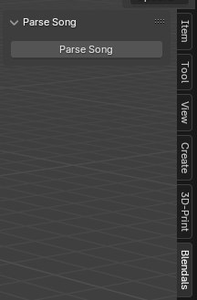
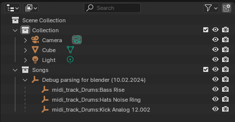
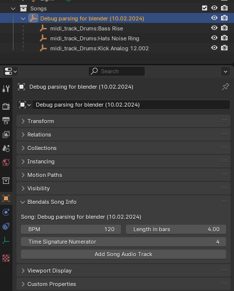
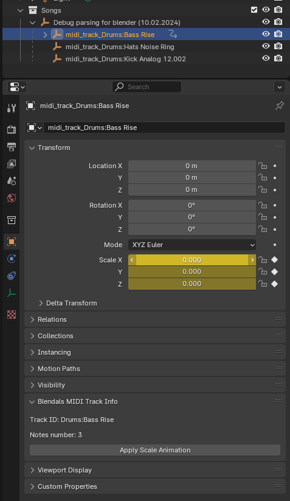

# About

The basic idea is to parse the Ableton Live project file(.als) 
and create a .json file with a track structure. Then you can use data from
this file to create a track visualization.

Use [blendals_parser](https://github.com/Alerion/blendals_parser) to get `song.json` file
from Ableton Live project file.


# Installation

Use python version that is used by targeted Blender version. You can find it in Blender's Scripting window.
```
python3.11 -m venv venv
. venv/Scripts/activate
poetry install
```


# Running code in Blender

## Install Blendals Addon

Find path to Blender executable. Fo Steam version it will be something like `<path to Steam>/steamapps/common/Blender/blender.exe`.

```
export BLENDER=<path to Blender>/blender.exe
$BLENDER
```

Add project root to [Script Directories](https://docs.blender.org/manual/en/latest/editors/preferences/file_paths.html#script-directories),
so Blendals addon can be loaded directly from a project folder.

You can find Script Directories here: `Edit > Preferences > File Paths`.

Restart Blender and activate addon. You should see the Blendas panel on the sidebar of the 3D View main window.


## Making changes to Addon

Make changes to code and reload scripts in Blender. To do this click on Blender icon in Menu and `System > Reload Scripts`.
You can right-click on this menu and add it to `Quick Favourits` for quick access with `Q` button.


# Add python dependency

[Poetry](https://python-poetry.org/) is used to manage project's dependencies.

For example, we want to add `dacite` ass a dependency. Run:

```
. venv/Scripts/activate
poetry add dacite
```

But addon is executed in Blender environment, so the previous step was to resolve dependencies conflicts
and to track all dependencies with Poetry. The next step is to make a package available in Blender environment.
We copy dependencies into `addons/dependencies` folder, and it is added into `sys.path`.

```
poetry export -f requirements.txt --output requirements.txt
pip install -r requirements.txt -t ./addons/dependencies
```

Repeat this if you update dependencies and restart Blender.


# Blender modules autocomplete in PyCharm

Run this in Blender python console to get path to modules:
```
>>> import bpy
>>> bpy.__path__
```

It should be something like this `<path to blender>/Blender/4.0/3scripts/modules/bpy`.
Add `<path to blender>/Blender/4.0/3scripts/modules` as Content Root to your PyCharm project.


# Workflow

1. Use [blendals_parser](https://github.com/Alerion/blendals_parser) to get `song.json` file
from Ableton Live project file. You can find prepared files in ``song_example`` folder.

2. Use Blendals side panel to parse song.json.



3. Empty objects for a song and each MIDI track were created. Track information is saved in an empty object to generate animation later.



4. You can view/edit song's properties on Object Properties tab. These properties are used to generate animation.



5. Select track and click "Apply Scale Animation". You can see animation applied to ``Scale`` properties.



6. Right click on ``Scale X``, ``Copy as New Driver``. Now select Cube, right click on Cube's ``Scale X`` property and ``Paste Driver``.
